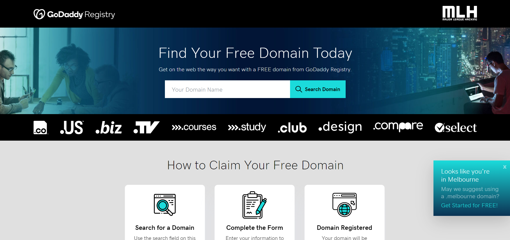
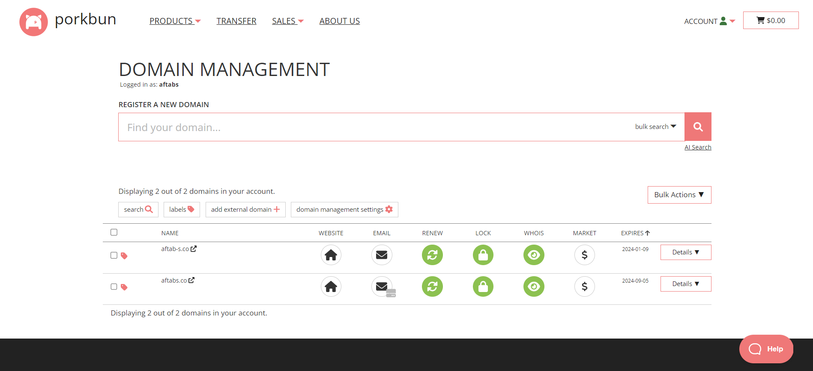
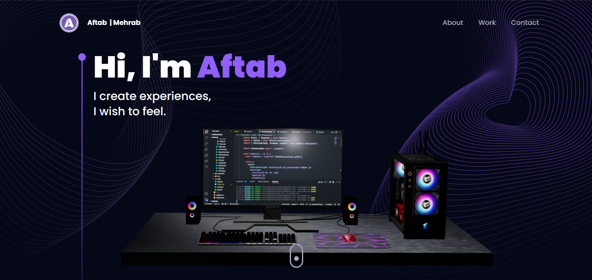

## Preconfigured Settings

1. Create website using ReactJs, ThreeJs and TailwindCSS.
2. Pushed it to Github Private Repository.
3. Create project in Firebase Console.
4. Linking local repository to the Firbase project.
5. Deploying website to Firebase.

## AIM : To Setup Custom Domain for an Existing Website

For the purpose of this challenge, I have a website (portfolio website) up and running, which is hosted on Firebase. As of now, the URL to the website is **portfolio-aftab.web.app**. What is needed, is to change the URL with a custom domain to something like **portfolio.aftabs.co**. Steps involved for achieving the above requirements are given as follows:

1. Go to **GoDaddy Registry** using the link provided by MLH. This will take you to a page like the one given below. There you can search for a domain name of your choice. In my case I searched for **aftabs** and thus found that **aftabs.co** is available. Then follow the steps involved to register that domain name under your email. Add the details and the promo-code (MLHGHWSEPT23) and continue to billing.

The billing and the final registration happens in another platform called **porkbun.com**. Create an account (if there isn't one already) and then continue. 

2. On the Porkbun admins page, all your registered domains will be listed. On hovering over the domain name, you can find DNS and NS options. To set up a subdomain like "**portfolio.aftabs.co**" you will need to configure the DNS settings in Porkbun. Add a new DNS record for the subdomain "**portfolio**". Add the following values. :

Type: CNAME | Name: portfolio | Value: portfolio-aftab.web.app | TTL: 1h (or use the default = 600) 

[TTL (Time to Live): You can set this to 600 (or leave it at the default value). TTL determines how long DNS information is cached by DNS servers. It's typically in seconds.]

After doing all that, you can see your Current Records. Ensure that the CNAME record created just now is present in that list.

3. Now go to Firebase console and click on custom domain under the firebase hosting window. Add "**portfolio.aftabs.co**" under the domain name entry. Follow the steps which includes adding an "**TXT**" record to the porkbun DNS settings of the domain name. The required parameters will be given in the Firebase tab and just copying and pasting the values will do the work. The TXT record (Text record) is a type of DNS (Domain Name System) record that contains text information associated with a domain. TXT records are versatile and serve various purposes, primarily for providing additional information about a domain or for verifying domain ownership for various services. In other words, it is required to verify if the input domain name "**portfolio.aftabs.co**" is actually owned by me. Click continue (Skip the last step as it is already done when CNAME record was added in step 2). 

AFter completing all the above steps, the website will be available at **portfolio.aftabs.co**. For some time it would give a warning "Connection not Secure" or something like that. This is because, it would take upto 24 hours to get the SSL certificate active. It will work perfectly fine after that.

